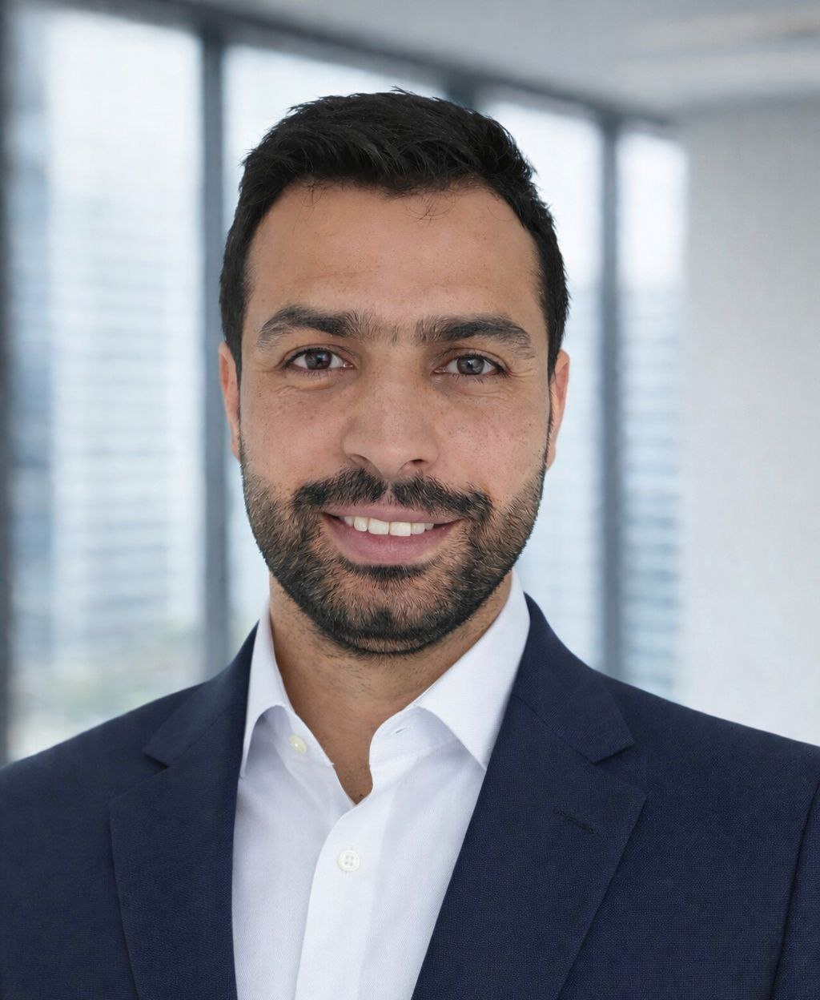

  <!-- HERO -->
  

    
    

      <h1>Muataz Albadri</h1>
      <h2> R&D Engineer & Scan-to-BIM Specialist </h2>
      

        I help engineering firms, contractors, and asset owners convert
        reality data into reliable digital twins and automated BIM workflows
        that reduce delivery time, minimize errors, and improve decision-making.
      

    

  

  

  <!-- SERVICES -->
  <section>
    <h2>Consulting Services</h2>
    

      

        Scan-to-BIM
        
Point clouds to Revit / IFC models with structured semantics and QA-ready outputs.

      

      

        AI for Reality Data
        
Automated detection of walls, openings, MEP elements, and assets from point clouds.

      

      

        BIM Automation
        
Python, Dynamo, and Revit API pipelines for scalable and repeatable BIM production.

      

      

        Digital Twins
        
Operational-ready BIM models connected to analytics and visualization platforms.

      

    

  </section>

  <!-- DEMO -->
  <section>
    <h2>Technical Demonstration</h2>
    <video autoplay muted loop playsinline>
      <source src="assets/demo.mp4" type="video/mp4">
    </video>
    

      Demonstrating Scan-to-BIM automation, AI segmentation, and BIM scripting workflows.
    

  </section>

  <!-- PROJECTS -->
  <section>
    <h2>Selected Engagements</h2>
    <ul>
      <li>
        Automated Indoor Scan-to-BIM 
        Reduced manual modeling time by over 60% across multi-storey buildings.
      </li>
      <li>
        AI-Based Object Recognition 
        Integrated point cloud segmentation directly into BIM authoring workflows.
      </li>
      <li>
        Enterprise BIM Automation 
        Developed reusable pipelines for large-scale project delivery.
      </li>
    </ul>
  </section>

  <!-- PORTFOLIO -->
  <section>
    <h2>Portfolio & Credentials</h2>
    <a href="assets/portfolio.pdf" target="_blank" class="button">
      Download Consultant Portfolio
    </a>
  </section>

  <!-- CONTACT -->
  <section id="contact">
    <h2>Contact</h2>
    
Email: your@email.com

    

      LinkedIn:
      <a href="https://www.linkedin.com/in/muataz-albadri-2290381a4/" target="_blank">
        linkedin.com/in/muataz-albadri
      </a>
    

  </section>

<footer>
  © {{ site.time | date: "%Y" }} Muataz Albadri · Scan-to-BIM & AI Consulting
</footer>

